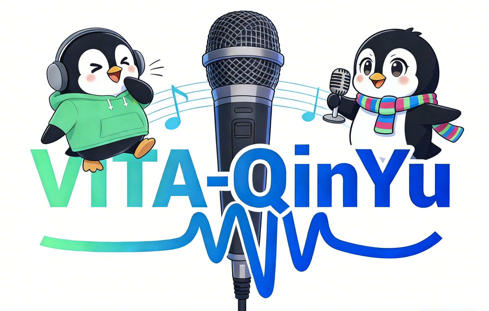

# VITA-QinYu: Expressive Spoken Language Model for Role-Playing and Singing

<p align="center">
    
</p>

<div align="center">
    <a href=""></a>
    <a href='https://tme-lyra-lab.github.io/VITA-QinYu/'></a>
    <a href='https://huggingface.co/collections/VITA-MLLM/vita-qinyu'> </a>
</div>

## ✨ Highlights

**VITA-QinYu**, the first end-to-end spoken language model that supports role-playing and singing via a hybrid text–speech modeling framework and a large-scale data synthesis pipeline, while achieving state-of-the-art performance in natural conversational speech.

- **Expressive Speech Generation.**  VITA-QinYu supports singing and role-playing capabilities within a unified end-to-end model.
- **Hybrid Speech–Text Modeling.**  VITA-QinYu adopts an interleaved speech–text modeling paradigm with parallel multi-codebook audio tokens to enable richer paralinguistic representation.
- **Large-Scale Synthetic Data.**  VITA-QinYu employs a comprehensive pipeline to generate large-scale, high-quality expressive speech data for training.
- **Strong Performance.**  VITA-QinYu achieves state-of-the-art conversational accuracy while improving expressive speech generation.
- **Open-Source Deployment**.  VITA-QinYu provides open-source models, training code, and a streaming full-duplex web demonstration.

## :fire: RoadMap

- **`2026.04.03`** 🌟 We release VITA-QinYu with model weights, inference & training code and web demo. Singing checkpoint is under internal review.

## 🔔 Models

| Model         | LLM Size | Huggingface Weights                            |
| ------------- | -------- | ---------------------------------------------- |
| VITA-QinYu-8B | 8B       | https://huggingface.co/VITA-MLLM/VITA-QinYu-8B |
| VITA-QinYu-4B | 4B       | https://huggingface.co/VITA-MLLM/VITA-QinYu-4B |

## Getting Started

### Prepare Environment

```
docker pull mikexu/vita-qinyu:base
```

### Get the Code

```
git clone https://github.com/VITA-MLLM/VITA-QinYu.git
cd VITA-QinYu
git submodule update --init --recursive
pip install -r requirements.txt
pip install -e .
```

### Download the required models

```shell
mkdir /vita-qinyu-models

# VITA-QinYu
hf download VITA-MLLM/VITA-QinYu-Models --local-dir /vita-qinyu-models/VITA-QinYu-Models
hf download VITA-MLLM/VITA-QinYu-4B --local-dir /vita-qinyu-models/VITA-QinYu-4B
hf download VITA-MLLM/VITA-QinYu-8B --local-dir /vita-qinyu-models/VITA-QinYu-8B

# FunAudioLLM/SenseVoiceSmall
hf download FunAudioLLM/SenseVoiceSmall --local-dir /vita-qinyu-models/FunAudioLLM/SenseVoiceSmall

# openai/whisper-large-v3
hf download openai/whisper-large-v3 --local-dir /vita-qinyu-models/openai/whisper-large-v3

# TEN-framework/TEN_Turn_Detection
hf download TEN-framework/TEN_Turn_Detection --local-dir /vita-qinyu-models/TEN-framework/TEN_Turn_Detection
```

## Inference

### Offline Inference

We provide a simple inference script that covers speech-to-speech, ASR and TTS examples.

```
CUDA_VISIBLE_DEVICES=0 python tools/inference_sts.py --model /vita-qinyu-models/VITA-QinYu-8B --output_dir /output
CUDA_VISIBLE_DEVICES=0 python tools/inference_sts.py --model /vita-qinyu-models/VITA-QinYu-4B --output_dir /output
```

### Online Inference

```
# Natural
CUDA_VISIBLE_DEVICES=0 python web_demo_stream.py --port 8080 --model /vita-qinyu-models/VITA-QinYu-4B
```

```
# RolePlay
CUDA_VISIBLE_DEVICES=0 python web_demo_stream.py --port 8080 --model /vita-qinyu-models/VITA-QinYu-4B --mode roleplay --role_description "该角色是一个幼儿女性，身份是世家千金，性格活泼机敏、爱撒娇，气质天真灵动，音色甜润，语速较快"
```

- `--mode`    Natural conversation when `mode=default`; role-playing when `mode=roleplay`.
- `--model`    the path of VITA-QinYu model
- `--role_description`    describe role information when `mode=roleplay`
- `--port`    the port of web demo  `default:8080`

Then you can visit `localhost:8080`

## Finetune

You can finetune your own model.

### download toysample

```
hf download VITA-MLLM/VITA-QinYu-ToySample --local-dir /vita-qinyu-models/ToySample
```

### scripts

```shell
bash scripts/deepspeed/vita_qinyu_utu/finetune.sh /vita-qinyu-models/ToySample/toy_sample.yaml /vita-qinyu-models/ToySample /vita-qinyu-models
bash scripts/deepspeed/vita_qinyu_qwen3/finetune.sh /vita-qinyu-models/ToySample/toy_sample.yaml /vita-qinyu-models/ToySample /vita-qinyu-models 
```

## Discussion

Discuss on [Github Issues](https://github.com/VITA-MLLM/VITA-QinYu/issues).

Scan the QR code to join our official QQ chat group.


## Statement

**VITA-QinYu is trained on large-scale open-source corpus, and its output has randomness. Any content generated by VITA-QinYu does not represent the views of the model developers. We are not responsible for any problems arising from the use, misuse, and dissemination of VITA-QinYu, including but not limited to public opinion risks and data security issues.**

## Acknowledgements

- [VITA](https://github.com/VITA-MLLM/VITA)
- [QinYu](https://github.com/TME-Lyra-Lab/QinYu/tree/main)
- [Youtu-LLM](https://huggingface.co/tencent/Youtu-LLM-2B)
- [Qwen3](https://github.com/QwenLM/Qwen3)
- [DeepDubbing](https://github.com/TME-Lyra-Lab/DeepDubbing)
- [MOSS-TTSD](https://github.com/OpenMOSS/MOSS-TTSD)
- [GLM-4-Voice](https://github.com/zai-org/GLM-4-Voice)

## Citation

**Coming soon...**
